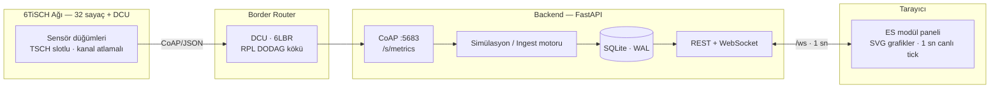

<div align="center">

# 📡 6TiSCH İzleme ve Konfigürasyon Paneli

### 868 MHz Sub-GHz · Zaman Paylaşımlı Kanal Atlamalı Ağlar için Web Tabanlı İzleme & Yönetim


</div>

---

## 🌟 Bu panelde ne var?

7 sekmeli, tek sayfalık, **canlı akan** bir operatör paneli. Hiçbir framework, hiçbir build adımı yok — tarayıcı aç, izle.

| Sekme | Ne gösterir? |
|---|---|
| 🏠 **Genel Bakış** | KPI'lar, 6TiSCH Ağı → Border Router → Bulut mimari şeması, kanal planı, görev döngüsü bütçe göstergeleri, olay akışı |
| 🧩 **Slotframe** | 3 taşıyıcı × 57 slot canlı ızgara, akan ASN sayacı, EB/paylaşımlı/veri hücreleri, `f = f_base + ((ASN + δ) mod N)` formülü ve atlama dizisi animasyonu |
| 🌡️ **Slot-Frekans** | Düğüm × zaman ısı haritası: hangi düğüm hangi slotta hangi alt bantta haberleşti, slot kayması grafiği, çakışma sayacı |
| 🕸️ **Kapsama / Topoloji** | RPL DODAG ağacı; bant / RSSI / hop renklendirme; düğüm tıkla → çekmece (sparkline'lar, ebeveyn geçmişi) |
| 🔋 **Enerji Profili** | Ağ toplamı ve düğüm enerji/batarya/TX grafikleri, ETSI %1–%10 tavan çizgileriyle görev döngüsü bütçe takibi |
| 🧭 **Yönlendirme** | RPL ebeveyn tablosu, 10 dk güncelleme sayıları, 24 saatlik ebeveyn değişim zaman çizelgesi, hop dağılımı |
| 🛠️ **Konfigürasyon** | Cihaz parametrelerini **CoAP PUT** ile değiştir; işlem kaydı + günlük. TX gücü düşürülünce RSSI/ETX gerçekten kötüleşir |

## 🏗️ Mimari



## 🚀 Hızlı Başlangıç

```bash
git clone https://github.com/AkerimC/6tisch-panel.git
cd 6tisch-panel
./baslat.sh                 # → http://127.0.0.1:8680
# farklı port: PORT=9000 ./baslat.sh
```

İlk açılışta **son 24 saatin verisi otomatik üretilir** (tohumlama); ardından motor gerçek zamanlı akmaya devam eder. Sıfırdan başlamak için:

```bash
rm -f data/dashboard.db*    # ve sunucuyu yeniden başlatın
```

> Gereksinimler: Python 3.10+ · sanal ortam ve bağımlılıklar `baslat.sh` tarafından otomatik kurulur.

## 🔬 Makale & Başvuru Formu ile Kalibrasyon

Panel, 22 saatlik 868 MHz saha ölçüm makalesindeki gerçek ağ parametrelerini birebir temel alır:

| Parametre | Değer | Kaynak |
|---|---|---|
| Timeslot / Slotframe | 17 ms · 57 slot = **969 ms** | makale |
| Taşıyıcılar | ch0 **869.525** MHz (Band O, %10, 500 mW) · ch1 **865.150** / ch2 **867.850** MHz (Band L, %1, 25 mW) | Şekil 11/12 |
| Kanal atlama dizisi | 7 elemanlı — 3× Band O, 4× Band L | makale |
| Ağ yapısı | 32 düğüm + DCU · 4 hop DODAG | Şekil 14 |
| Görev döngüsü asimetrisi | 7402 ve 71D8 Band L tavanına oturur, **71C0 limiti aşar (%102)**, 7181 rahattır | Tablo 14 |
| Ebeveyn değişimi | 32 düğümden ~25'i 24 saatte en az bir kez ebeveyn değiştirir | makale |
| PDR | 3 MAC denemesi sonrası teslim olasılığı: `1 − (1 − 1/ETX)³` | makale |

## 🔌 Gerçek Veri Hattı

Sistem uçtan uca veri hattını birebir uygular: **cihaz → CoAP (JSON) → border router → backend**. Gerçek cihazlar bağlandığında simülasyon değerleri yerine gelen veri kullanılır (kaynak etiketi `real`).

**CoAP:** `PUT/POST coap://<sunucu>:5683/s/metrics` — gövde: `application/json`

```json
{
  "node_id": "7402", "rssi": -75.2, "snr": 24.8, "etx": 2.33,
  "energy_mj": 48.6, "slot_id": 12, "ts": 1789478258.2,
  "retrans": 3, "carrier": 0, "band": "O"
}
```

HTTP tercih edilirse: `POST /api/ingest` · şema: `GET /api/ingest/schema`
Zorunlu alanlar: `node_id, rssi, snr, etx, energy_mj, slot_id, retrans`

## 📡 API Özeti

| Uç | Amaç |
|---|---|
| `GET /api/network` | ASN, slot, kanal, slotframe & kanal planı, hücre haritası, görev döngüsü özeti |
| `GET /api/nodes` · `/api/nodes/{id}` | Düğüm anlık durumu + alt ağacı |
| `GET /api/history/{id}?hours=24&step_s=120` | Metrik zaman serisi |
| `GET /api/energy` · `/api/duty/{id}` | Enerji ve görev döngüsü serileri (ETSI limitleriyle) |
| `GET /api/slotlog` | Slot–taşıyıcı kullanım kayıtları |
| `GET /api/topology` | DODAG + ebeveyn değişimleri (döngü dezenfeksiyonlu) |
| `GET /api/events` · `/api/configs` | Olay ve konfigürasyon günlükleri |
| `POST /api/config` | Dinamik konfigürasyon (CoAP PUT simülasyonu) |
| `WS /ws` | 1 sn'lik canlı ağ anlık görüntüsü |

## 🛠️ Konfigürasyon Gerçekten Etkiliyor

Panelde gönderdiğin CoAP PUT yalnızca loglanmaz — **simülasyon motorunu gerçekten değiştirir:**

- `tx_power_dbm` ↓ → düğümün `rssi_seed`'i düşer → RSSI/ETX kötüleşir → retransmissions artar
- `rssi_threshold` → komşuluk eşiği bant tercihini (`band_split`) kaydırır
- Değişiklikler panelde anında izlenebilir; tüm işlem kaydı `configs` tablosunda tutulur

## 🗂️ Yapı

```
6tisch-panel/
├── backend/
│   ├── config.py    # sabitler, kanal planı, topoloji (makale/form değerleri)
│   ├── engine.py    # simülasyon motoru + konfigürasyon/ingest mantığı
│   ├── store.py     # SQLite katmanı (WAL)
│   └── main.py      # FastAPI: REST + WebSocket + CoAP sunucusu (:5683)
├── frontend/        # bağımlılık yok (framework'süz ES modülleri + SVG)
├── data/            # dashboard.db (otomatik oluşur, git'e girmez)
├── baslat.sh · requirements.txt
```

## 🗺️ Yol Haritası

- [ ] Panel ekran görüntüleri & GIF tanıtımı
- [ ] GitHub Actions CI (py_compile + node --check)
- [ ] MSF (Minimal Scheduling Function) hücre ayrıştırma görselleştirmesi
- [ ] Gerçek donanım entegrasyonu pilotu (Contiki-NG + CC1312R1)

---

<div align="center">

Contiki-NG / TSCH / 6TiSCH · IEEE 802.15.4e · ETSI EN 300 220-2

</div>
