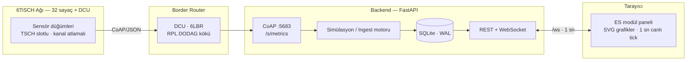

<div align="center">

# 📡 6TiSCH İzleme ve Konfigürasyon Paneli

### 868 MHz Sub-GHz · Zaman Paylaşımlı Kanal Atlamalı Ağlar için Web Tabanlı İzleme & Yönetim


</div>

---

## 🌟 Bu panelde ne var?

7 sekmeli, tek sayfalık, **canlı akan** bir operatör paneli. Hiçbir framework, hiçbir build adımı yok — tarayıcı aç, izle.

| Sekme | Ne gösterir? |
|---|---|
| 🏠 **Genel Bakış** | KPI'lar, 6TiSCH Ağı → Border Router → Bulut mimari şeması, kanal planı, görev döngüsü bütçe göstergeleri, olay akışı |
| 🧩 **Slotframe** | 3 taşıyıcı × 57 slot canlı ızgara, akan ASN sayacı, EB/paylaşımlı/veri hücreleri, `f = f_base + ((ASN + δ) mod N)` formülü ve atlama dizisi animasyonu |
| 🌡️ **Slot-Frekans** | Düğüm × zaman ısı haritası: hangi düğüm hangi slotta hangi alt bantta haberleşti, slot kayması grafiği, çakışma sayacı |
| 🕸️ **Kapsama / Topoloji** | RPL DODAG ağacı; bant / RSSI / hop renklendirme; düğüm tıkla → çekmece (sparkline'lar, ebeveyn geçmişi) |
| 🔋 **Enerji Profili** | Ağ toplamı ve düğüm enerji/batarya/TX grafikleri, ETSI %1–%10 tavan çizgileriyle görev döngüsü bütçe takibi |
| 🧭 **Yönlendirme** | RPL ebeveyn tablosu, 10 dk güncelleme sayıları, 24 saatlik ebeveyn değişim zaman çizelgesi, hop dağılımı |
| 🛠️ **Konfigürasyon** | Cihaz parametrelerini **CoAP PUT** ile değiştir; işlem kaydı + günlük. TX gücü düşürülünce RSSI/ETX gerçekten kötüleşir |

## 🏗️ Mimari


```mermaid
flowchart LR
    subgraph A["6TiSCH Ağı — 32 sayaç + DCU"]
        N1["Sensör düğümleri<br/>TSCH slotlu · kanal atlamalı"]
    end
    subgraph B["Border Router"]
        DCU["DCU · 6LBR<br/>RPL DODAG kökü"]
    end
    subgraph C["Backend — FastAPI"]
        E["Simülasyon / Ingest motoru"]
        S[("SQLite · WAL")]
        API["REST + WebSocket"]
        CO["CoAP :5683<br/>/s/metrics"]
    end
    subgraph D["Tarayıcı"]
        FE["ES modül paneli<br/>SVG grafikler · 1 sn canlı tick"]
    end
    N1 -->|CoAP/JSON| DCU
    DCU --> CO --> E
    E --> S --> API
    API <-->|"/ws · 1 sn"| FE
```

## 🚀 Hızlı Başlangıç

```bash
git clone https://github.com/AkerimC/6tisch-panel.git
cd 6tisch-panel
./baslat.sh                 # → http://127.0.0.1:8680
# farklı port: PORT=9000 ./baslat.sh
```

İlk açılışta **son 24 saatin verisi otomatik üretilir** (tohumlama); ardından motor gerçek zamanlı akmaya devam eder. Sıfırdan başlamak için:

```bash
rm -f data/dashboard.db*    # ve sunucuyu yeniden başlatın
```

> Gereksinimler: Python 3.10+ · sanal ortam ve bağımlılıklar `baslat.sh` tarafından otomatik kurulur.

## 🔬 Makale & Başvuru Formu ile Kalibrasyon

Panel, 22 saatlik 868 MHz saha ölçüm makalesindeki gerçek ağ parametrelerini birebir temel alır:

| Parametre | Değer | Kaynak |
|---|---|---|
| Timeslot / Slotframe | 17 ms · 57 slot = **969 ms** | makale |
| Taşıyıcılar | ch0 **869.525** MHz (Band O, %10, 500 mW) · ch1 **865.150** / ch2 **867.850** MHz (Band L, %1, 25 mW) | Şekil 11/12 |
| Kanal atlama dizisi | 7 elemanlı — 3× Band O, 4× Band L | makale |
| Ağ yapısı | 32 düğüm + DCU · 4 hop DODAG | Şekil 14 |
| Görev döngüsü asimetrisi | 7402 ve 71D8 Band L tavanına oturur, **71C0 limiti aşar (%102)**, 7181 rahattır | Tablo 14 |
| Ebeveyn değişimi | 32 düğümden ~25'i 24 saatte en az bir kez ebeveyn değiştirir | makale |
| PDR | 3 MAC denemesi sonrası teslim olasılığı: `1 − (1 − 1/ETX)³` | makale |

## 🔌 Gerçek Veri Hattı

Sistem uçtan uca veri hattını birebir uygular: **cihaz → CoAP (JSON) → border router → backend**. Gerçek cihazlar bağlandığında simülasyon değerleri yerine gelen veri kullanılır (kaynak etiketi `real`).

**CoAP:** `PUT/POST coap://<sunucu>:5683/s/metrics` — gövde: `application/json`

```json
{
  "node_id": "7402", "rssi": -75.2, "snr": 24.8, "etx": 2.33,
  "energy_mj": 48.6, "slot_id": 12, "ts": 1789478258.2,
  "retrans": 3, "carrier": 0, "band": "O"
}
```

HTTP tercih edilirse: `POST /api/ingest` · şema: `GET /api/ingest/schema`
Zorunlu alanlar: `node_id, rssi, snr, etx, energy_mj, slot_id, retrans`

## 📥 4eMAC RAMLOG alımı

`cooja/ramlog/ramlog-4emac.csc` 1 Exp5438 root + 32 istemcili Cooja senaryosudur. İstemci firmware’leri mevcut `os/services/ram-log-send` modülünü ve `MAKE_MAC_4EMAC` yapılandırmasını kullanır. İstemci, sentetik örnekler yerine 4eMAC MAC iletim sonuçlarını RAMLOG kuyruğuna kaydeder; sender bunları yalnızca kimlik doğrulama ve parent transmit cell koşulları sağlandığında yollar. Exp5438’in RAM sınırı için istemci başına neighbor havuzu 12, RAMLOG kuyruğu 32 kayıtla sınırlandırılmıştır. Cooja topolojisi 30 birim aralıklı ızgaradır; proje beacon aralığı katılımı hızlandırmak için 1–2 saniyedir. Root alıcı ve host serial bridge bu panel reposundadır; USB’deki Contiki ağacında hiçbir dosya değiştirilmez.

Mevcut RAMLOG sender `0x04, kayıt_sayısı` başlığından sonra kayıt başına `module_id, error_code, device_uptime_u32_be` (6 bayt) gönderir. Root gönderen IPv6 adresinin son 16 bitini node ID olarak kullanır; tam IPv6 adresi ve kayıt alanları JSONL serial çıkışına yazılır, bridge de `POST /api/ramlog` ile panele yollar. `device_ts` cihaz açılışından beri saniyedir; panel ayrıca kendi alım zamanını saklar. RAMLOG UDP paketi log seviyesini taşımadığı için arayüzde yer almaz. Cooja testinde iletim durumları `module_id=0x55`, `error_code=0x31/0x32` olarak gözlemlendi.

RAM Log panelinde zaman aralığı, düğüm ve modül filtreleri; açıklamalı bilinen MAC hata kodları, tam kayıt sayısı ve sayfalama bulunur. Liste her sayfada 100 kayıt gösterir; API varsayılanı da 100 kayıttır. Bilinmeyen modül ve hata kodları hex değerleriyle gösterilir.

### 4eMAC TX/RX olayları

Kanal ve ACK sonuçları mevcut 6 baytlık RAMLOG kaydına sığmadığından ayrı `0x06` UDP akışı kullanılır; `ram-log.c` ve RAMLOG `0x04` biçimi değiştirilmez. MAC iletim callback’i her sonucu gerçek radyo kanalında ve karşı düğüm ID’siyle toplar; alım sayacı yalnızca kabul edilmiş ve yinelenmemiş DATA/CMD çerçevelerini kapsar (ACK/EACK, EB ve kopya çerçeveler RX sayılmaz). Düğümler olayları 6’lı paketlerle root’a yollar; panel root seri JSONL hattını paylaşarak `POST /api/mac-events` ile `mac_events` tablosuna kaydeder. Başarı `MAC_TX_OK`/ACK, başarısız ACK sonucu `MAC_TX_NOACK` olarak ayrılır; her olayda cihaz uptime’ı ve panel alım zamanı tutulur.

**TX/RX İstatistik** sekmesi her kanal ve her node için `başarılı TX / toplam TX` ile başarı yüzdesini (ör. `9/10 · %90`) ve kabul edilen RX sayısını gösterir. Ek grafikler tüm kanalları ve tüm node’ları karşılaştırır; kanal/node detay seçicileriyle tekil TX başarı ve RX grafiklerine geçilir. Grafik tipi sütun veya çizgi olarak seçilebilir. Grafikler zaman, node ve kanal kapsamı filtrelerine uyar; olay listesindeki yön/sonuç filtreleri grafiğin TX başarı paydasını değiştirmez. `TX başarılı` sayacı yayın (broadcast, `ack_expected = 0`) TX’lerini de kapsar; ACK bekleyen TX adedi ayrıca KPI etiketinde verilir. Kaynak→hedef node’a göre link istatistiği ve olay detayında yön bilgisi de bulunur; routed TX/RX için bunlar fiziksel 4eMAC komşusunu gösterir. Yayın çerçevelerinde karşı taraf olmadığı için link istatistiğinde `?` kutusunda toplanır ve TX/RX yönleri ayrı satırlarda görünür. API `GET /api/mac-events?hours=24` olup `limit`/`offset` ile sayfalanır. Kanal numarası `0` geçerli bir taşıyıcıdır (`CARRIERS[0]` = 869.525 MHz, `HOPSEQ`’da 7 sıralamanın 3’ünde kullanılır) ve panelde sıfır değeri özel bir anlam taşımaz; `peer_node = "ffff"` yayını belirtir ve istatistiklerde `null` olur.

Veri saklama süresi **48 saattir** (`store.purge_older_than`, 30 dakikada bir çalışır); bu yüzden arayüzdeki zaman aralıkları 1/6/12/24/48 saat ile sınırlıdır. RAMLOG ve diğer zaman serileri aynı politikayla temizlenir.

**Gönderim sıklığı notu:** değiştirme yetkin olmayan mevcut `ram-log.c`, kayıt sayısı 8’i aşınca 2 saniyelik timer döngüsünde paket yollar. Bu entegrasyon sender’ın periyodunu değiştirmez; dolayısıyla “5 dakikada bir” davranışı mevcut kodda yoktur.

### Çalıştırma

1. Makefile’lar varsayılan olarak `/home/krm/contiki-ng` yolunu kullanır. Başka bir checkout kullanıyorsan `CONTIKI` değerini yalnızca panel reposundaki `cooja/ramlog/{root,node}/Makefile` dosyalarında güncelle.
2. Paneli `./baslat.sh` ile başlat.
3. `/home/krm/contiki-ng/tools/cooja` dizininde `./gradlew run --args="--gui --contiki=/home/krm/contiki-ng --logdir=/tmp/cooja-ramlog /home/krm/Resimler/harnes/Tubitak-arayuz/6tisch-panel/cooja/ramlog/ramlog-4emac.csc"` komutuyla Cooja’yı ve `cooja/ramlog/ramlog-4emac.csc` senaryosunu aç. Firmware’ler ilk yüklemede `TARGET=exp5438` ile oluşturulur; root’un MoteID’si 5’tir, sender hedef adresi buna göre ayarlanmıştır. Senaryo root serial socket’ini TCP `60001` portunda açar.
4. Panel reposunda köprüyü başlat:

   ```bash
   python3 cooja/ramlog/serial_bridge.py \
     --serial-host 127.0.0.1 --serial-port 60001 \
     --api-url http://127.0.0.1:8680/api/ramlog
   ```

5. Panelde **RAM Log** sekmesini aç. `GET /api/ramlog?hours=24` kayıtları; `node_id` ve `module_id` ile filtrelenmiş listeyi döndürür. Kayıtlar `ram_logs` tablosunda tutulur; RSSI/ETX/enerji telemetrisiyle karıştırılmaz.

Örnek bridge/API JSON’u:

```json
{"node_id":"0101","module_id":85,"error_code":49,"device_ts":368}
```

## 📡 API Özeti

| Uç | Amaç |
|---|---|
| `GET /api/network` | ASN, slot, kanal, slotframe & kanal planı, hücre haritası, görev döngüsü özeti |
| `GET /api/nodes` · `/api/nodes/{id}` | Düğüm anlık durumu + alt ağacı |
| `GET /api/history/{id}?hours=24&step_s=120` | Metrik zaman serisi |
| `GET /api/energy` · `/api/duty/{id}` | Enerji ve görev döngüsü serileri (ETSI limitleriyle) |
| `GET /api/slotlog` | Slot–taşıyıcı kullanım kayıtları |
| `GET /api/topology` | DODAG + ebeveyn değişimleri (döngü dezenfeksiyonlu) |
| `GET /api/events` · `/api/configs` | Olay ve konfigürasyon günlükleri |
| `POST /api/config` | Dinamik konfigürasyon (CoAP PUT simülasyonu) |
| `WS /ws` | 1 sn'lik canlı ağ anlık görüntüsü |

## 🛠️ Konfigürasyon Gerçekten Etkiliyor

Panelde gönderdiğin CoAP PUT yalnızca loglanmaz — **simülasyon motorunu gerçekten değiştirir:**

- `tx_power_dbm` ↓ → düğümün `rssi_seed`'i düşer → RSSI/ETX kötüleşir → retransmissions artar
- `rssi_threshold` → komşuluk eşiği bant tercihini (`band_split`) kaydırır
- Değişiklikler panelde anında izlenebilir; tüm işlem kaydı `configs` tablosunda tutulur

## 🗂️ Yapı

```
6tisch-panel/
├── backend/
│   ├── config.py    # sabitler, kanal planı, topoloji (makale/form değerleri)
│   ├── engine.py    # simülasyon motoru + konfigürasyon/ingest mantığı
│   ├── store.py     # SQLite katmanı (WAL)
│   └── main.py      # FastAPI: REST + WebSocket + CoAP sunucusu (:5683)
├── frontend/        # bağımlılık yok (framework'süz ES modülleri + SVG)
├── cooja/ramlog/     # 4eMAC Cooja root/client, wire parser ve serial→HTTP köprüsü
├── data/            # dashboard.db (otomatik oluşur, git'e girmez)
├── baslat.sh · requirements.txt
```

## 🗺️ Yol Haritası

- [ ] Panel ekran görüntüleri & GIF tanıtımı
- [ ] GitHub Actions CI (py_compile + node --check)
- [ ] MSF (Minimal Scheduling Function) hücre ayrıştırma görselleştirmesi
- [ ] Gerçek donanım entegrasyonu pilotu (Contiki-NG + CC1312R1)

---

<div align="center">

Contiki-NG / TSCH / 6TiSCH · IEEE 802.15.4e · ETSI EN 300 220-2

</div>
